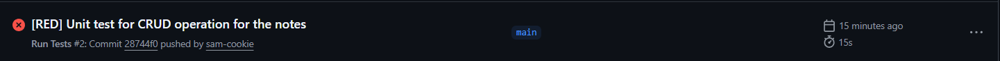
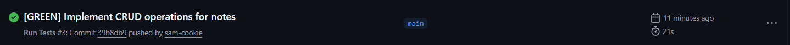
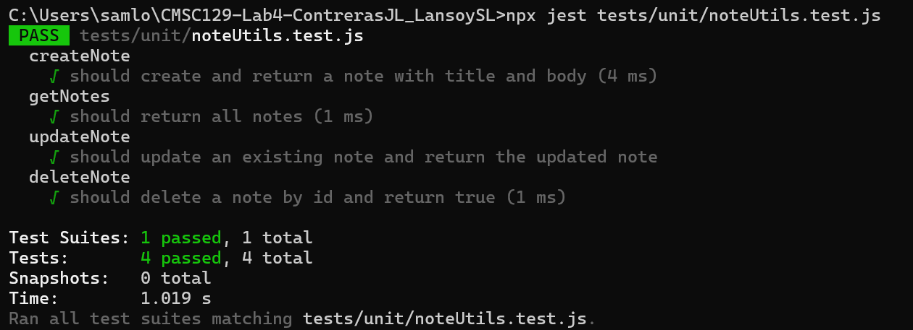
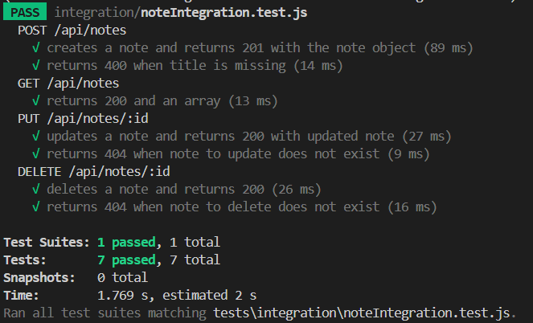
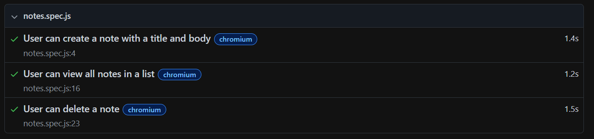

  # CMSC129-Lab4-ContrerasJL_LansoySL

  > Notes app by Contreras and Lansoy

  ## Live URL

  > _To be added after deployment_

  ---

  ## App Description

  This is a simple note-taking web application built as a single-resource CRUD app. Users can create, view, update, and delete personal notes. Each note has a title and a body. Data is stored in-memory on the server side. The app is built using React (Vite) for the frontend and Express for the backend and follows a Test-Driven Development (TDD) workflow.

  ---

  ## User Stories

  1. As a user, I want to create a note with a title and body, so that I can save and write my thoughts.
  2. As a user, I want to view all my notes in a list, so that I'll be able to find them later.
  3. As a user, I want to delete a note, so that I can remove notes I don't need anymore.

  ---

  ## Tech Stack

  | Layer                | Technology                    |
  | -------------------- | ----------------------------- |
  | Frontend             | React (Vite)                  |
  | Backend              | Node.js + Express             |
  | Data Storage         | In-memory array (server-side) |
  | Unit Testing         | Jest                          |
  | Integration Testing  | Jest + Supertest              |
  | System / E2E Testing | Playwright                    |
  | CI/CD                | GitHub Actions                |
  | Deployment           | Vercel (frontend)             |

  ---

  ## CI/CD Setup

  - **Tool:** GitHub Actions
  - **Trigger:** Every push to `main`
  - **Pipeline:** Runs all unit, integration, and system tests automatically
  - **Screenshots:**
    - Failing pipeline run (RED phase): 
    - Passing pipeline run (GREEN phase): 

  ## Testing Strategy

  **Unit tests** will cover all isolated business logic functions. This will include the note validation like the title must not be empty and body must not exceed character limit, and generating of ID. These tests do not touch HTTP or the browser.

  **Integration tests** will cover the full HTTP request-response cycle using Supertest. Specifically, a POST request to create a note and a GET request to retrieve all notes, making sure that it verifies correct status codes and response bodies.

  **System tests** will simulate real user journeys in a browser using Playwright. One test per user story: creating a note using the UI, viewing the notes list, and deleting a note. This verifies that DOM reflects the expected state after each action.

  ---

  ## Test Results

  ### Unit Tests

  

  ### Integration Tests

  

  ### System Tests
  

  ## Setup Instructions

  ### Clone the repository

  ```bash
  git clone https://github.com/CMSC129-LABS/CMSC129-Lab4-ContrerasJL_LansoySL
  cd CMSC129-Lab4-CMSC129-Lab4-ContrerasJL_LansoySL
  ```

  ### Install frontend dependencies

  ```bash
  cd client
  npm install
  ```

  ### Install backend dependencies

  ```bash
  cd ../server
  npm install
  ```

  ### Run the frontend (from /client)

  ```bash
  npm run dev
  ```

  ### Run the backend (from /server)

  ```bash
  node index.js
  ```

  ### Run unit + integration tests
  ```bash
  npx jest tests/unit/ && npx jest tests/integration/
  ```

  ### Run system tests
  ```bash
  npx playwright test tests/system/
  ```

  ## Reflection

  ### Contreras
  **What did you find most difficult about writing tests before code?**

  The most difficult part was visualizing the implementation before it existed. I was used to building the UI first and debugging from there to see if functionality worked, so writing tests first felt unfamiliar. I had to decide upfront what status codes, response bodies, and routes to expect without being able to run anything. It was also easy to forget edge cases like missing fields returning 400 or nonexistent IDs returning 404.

  **Did writing tests first change the way you designed your code? How?**

  Yes. Because the tests defined the expected behavior first, the implementation had to match that contract exactly. For example, the controller had to return exactly 201 with the note object, not just any success response. It also forced a cleaner separation where the controller only does what the tests require, nothing more. Without TDD, I might have added extra logic or returned different status codes without thinking about consistency. The tests acted as a specification that kept the code focused and minimal.

  ### Lansoy
  **What did you find most difficult about writing tests before code?**
  The most difficult part of writing tests before code was thinking about what our program or code should do before implementing it. I was used to just writing code immediately and just praying it works well, so this time, it felt unnatural. Defining behavior before implementation is something that I am not used to, but it felt the most right way to make sure what we're building is actually working. 

  **Did writing tests first change the way you designed your code? How?**

  Writing tests first really changed how I designed my code. Since the tests had to call our functions directly, I was more writing smaller and more focused functions that were easy to test instead of doing a big feature all at once. For example, in my case, separating generateId from createNote was a direct result of wanting clean, testable units. Without TDD, I might have written one large function that did everything which is harder to maintain and test.